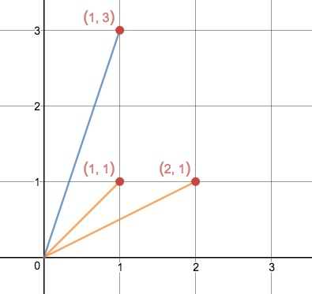
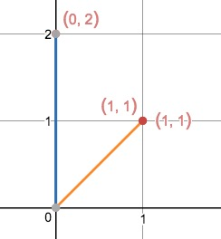
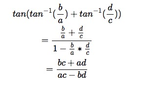
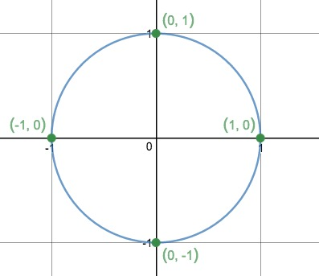
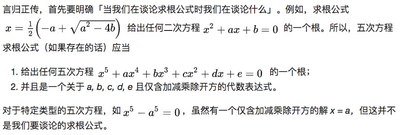
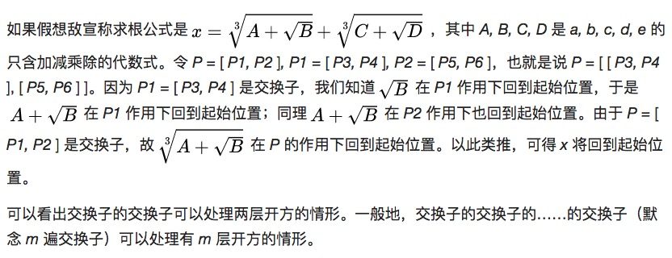
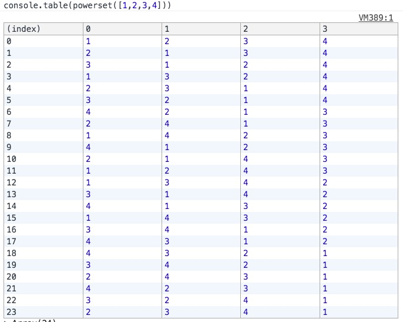
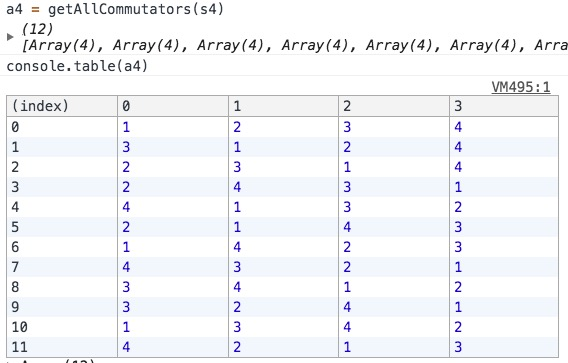
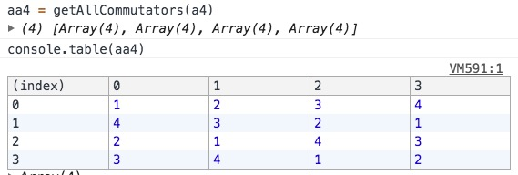

# 一般一元五次（及以上）方程无求根公式的直观解释

> 本文假定读者具有中学及以上数学基础

<!-- TOC -->

- [一般一元五次（及以上）方程无求根公式的直观解释](#一般一元五次及以上方程无求根公式的直观解释)
  - [前言](#前言)
  - [复数的本质](#复数的本质)
  - [根号对复数的作用](#根号对复数的作用)
  - [根的置换](#根的置换)
  - [根号的魔法](#根号的魔法)
  - [根号的局限](#根号的局限)
  - [程序证明](#程序证明)
  - [推广到其他次方程](#推广到其他次方程)

<!-- /TOC -->

## 前言

记得中学学方程的时候老师提到过高次方程的可解性问题，那时候我满脑子想的是上课怎么睡觉不会让老师发现和下课怎么和隔壁班的美女偶遇，对这种事情自然不会放在心上。然而命运和人性就是这么捉摸不定，在远离了课堂和考试之后，我发现自己对这种问题越来越感兴趣了……

知乎上 [这个问题][1] 出现在我时间线后，我看完了下面的每一个答案，用心的超长答案不少，给的一些链接也是干货满满。其中我觉得最认真的回答是匡世珉的[这个回答][2]，（我能看懂的）最严肃的回答是韩京俊写的[一篇论文][3]，最直观易懂的是姜子麟的[这个回答][4]，最生动的是一个 YouTube 上的[视频][5]，最全面的回答是一个三百多页的[英文 pdf][6]，来自 V.I. Arnold 的课程讲义（我只看了看目录。。）  
其中韩京俊、姜子麟和 YouTube 上的视频用的都是同样的方法，本文也将使用这种方法来解释。

> 说到 V.I. Arnold，这位可是个传说级的大牛，「数学直觉主义」代表人物，对形式化的公理证明不屑一顾（@罗素 和他的数学原理。。），认为数学是物理的一部分，对剥离了与物理世界的联系、剔除了直观感觉的纯粹抽象的数学深恶痛绝。请让我引用他演讲说的一段话（的中文译文）:  
（source: [英文译文][7]和[中文译文][8]）

> 数学是物理的一部分。物理学是一门实验科学，它是自然科学的一部分。而数学是物理学中只需要花费较少的代价进行实验的那一部分。例如 Jacobi 恒等式（保证三角形三条高交于一点）就是一个实验事实，正如同地球是圆的（即同胚于球体）这样的事实一样。但是发现前者却要比发现后者需要较少的代价。在20世纪中叶，人们试图严格地区分物理与数学，其造成的后果是灾难性的……

言归正传，既然这个问题已经有这么多答案了，为什么还会有这篇文章呢？

因为这些回答有些公式多得让人眼花头疼，有些专用术语深奥得只能让本来就懂这个定理的人看懂，有的通俗易懂却偏偏缺失了关键地方的证明……我绝不敢说这篇文章能答得比这些答案好，但我承诺本文尽量不用超出中学水平的数学公式，尽量让最多的人能够看懂。  
有些数学证明可以不用公式甚至不用文字就能让人看懂（比如[余弦定理的无字证明][9]），恰好的是，这个定理也堪堪让人不用公式就能理解其证明。

其实，这个问题在两百年前就已经被人类解决了，定理的名字叫做[阿贝尔-鲁菲尼定理][12]。

问题的研究开始于大名鼎鼎的拉格朗日，（半）证明于鲁菲尼，完证于阿贝尔，升华于伽罗华。其中过程大家可以阅读北大院士丁伟岳写的[一篇文章][10]。阿贝尔和伽罗华都是两个颇具悲剧色彩的天才，都死于二十几岁，他们的思想因为超前于时代而生前不为人所重视，死后人们才渐渐发现其过人之处。特别是伽罗华，人们常把他创建的群论看作 19 世纪最伟大的数学成就，如果他不是 21 岁就死于一场决斗，他所能取得的成就将无法想象。感兴趣的读者可以搜索了解这些人的生平。

当然，大家也不要忘记，是拉格朗日首先意识到根的置换起到的重要作用，开辟了这项研究的康庄大道，并提出了一般高次（五次及以上）方程没有求根公式的猜测（背景是人们发现一元三次及四次方程的求根公式后几百年内都没能发现五次及以上方程的求根公式）。

**正如文章题目所说，本文利用现代浏览器的高级功能，给出了这个定理的直观（动画）解释，读者甚至可以自己动手尝试和验证。为了确保文中的动画能够正常运行，请读者使用 PC 或 Mac 上的的现代浏览器（如 Chrome, Firefox, Safari 等）浏览本文。**

**本文主要参照的是姜子麟的回答，甚至可以说是那篇回答的补充说明。**

## 复数的本质
> 如果读者已经理解了复数的几何意义，可跳过本章。

> Q：为什么要引入复数，难道就不能在实数范围内好好玩耍吗。。  
A：还真不能，后面会给出原因。

> 本文绝不会提到一个数的平方竟然会等于 -1 这么反人类的事。

我们先来定义一种结构和两个运算（不要被唬住了，都是很简单的运算）  
一种结构（a,b,c,d 都是实数）：  
`(a, b)`  
两个运算：  
「加法」： `(a, b) + (c, d) = (a+c, b+d)`  
「乘法」： `(a, b) · (c, d) = (ac-bd, ad+bc)`  
> Q：为啥要定义这么稀奇古怪的结构和运算？  
A：别急，后面会有说明。

大家一定会觉得第一个运算十分眼熟，这不就是向量的加法吗！可是第二个运算是什么东西，为啥结果不是 `ac + bd` ？

管它是啥，带入几个简单的数字算算再说。  
`(1, 1) · (2, 1) = (1*2-1*1, 1*1+1*2) = (1, 3)`

有点意思，把这几个数画到坐标系上看看，括号中前的数字对应水平轴上的取值，后面的数字对应竖直轴的取值。  
  
似乎看不出什么明显规律？不过 (1, 1)的平方和乘以(2, 1)的平方和刚好等于(1, 3)的平方和。。  
另外注意三条线段和水平轴之间的夹角，会不会两条橙色线段与水平轴的夹角之和等于蓝色线段与水平轴的夹角？

我们先来验证平方和：  


关于夹角我们再举一个例子看看：  
`(1, 1) · (1, 1) = (0, 2)`  
  
两个45度角加起来刚好等于90度角！

大胆假设后，值得我们求证一下了，由于我们只知道点的坐标而不知道角度，有必要请出三角函数（和差化积）来：  
  
需要注意的是，此处证明并不严谨，因为 y = tan(x) 是一个周期函数，在一个周期内才是单调函数。

> Q：可是，这些东西又有什么用？  
A：**把上述所有形如 `(a, b)` 的结构全部换成 `a + bi`，恭喜你，你已经理解了复数的本质！**

> 诉诸语言的话：  
> 如果把每一个复数看作是 x 轴为实部，y 轴为虚部的坐标系中的一个向量，那么  
> - 复数的加法就是向量的加法  
> - **复数的乘法得出的结果所代表的向量，其模长等于两乘数的模长之积，其与实数轴的夹角等于两乘数与实数轴的夹角之和。**

最漂亮的是，**我们定义的运算和我们曾经学过的实数运算法则完全相容，也就是说，如果把以前所有学过的实数运算统统改成 (a, 0) 这种结构的运算，结果全都等价！**

比如:  
`1 + 1 = 2` 对应 `(1, 0) + (1, 0) = (2, 0)`  
`2 * 3 = 6` 对应 `(2, 0) · (3, 0) = (6-0, 0+0) = (6, 0)`

而且，我们定义的运算同样满足分配律和结合律！感兴趣的读者可以拿纸笔检验一下。  
思考题： 减法和除法怎么办？

## 根号对复数的作用
> √2 到底代表什么意思？  

如果用中学老师教给我们的知识，我们知道它是一个平方等于 2 的无理数，其小数表达是 1.414...  

> 可它为什么不能代表 -1.414... ?

因为老师说它就是这么定义的。。  

> 已知 x^2 = 2，请问 x 等于多少？

在实数范围内，显然有两个数满足这个条件，分别是 √2 和 -√2。  

> 如果拓展到复数呢？

有哪些复数（所代表的向量），它乘以自身后会落在 (2, 0)这个点？  
这些复数必须满足以下条件：
- 它代表的向量与实数轴的夹角的两倍为 0（或 2π 的整数倍）
- 它代表的向量的模长的平方等于 (2^2+0^2)^(1/2) = 2

依然只有两个数（向量）满足这个条件，分别是 (√2, 0) 和 (-√2, 0)，前者与实数轴的夹角为 0，两倍还是 0； 后者为 π，两倍后为 2π

> 1 的四分之一次方在复数域是什么意思？

它代表了这么一个（些）数，这个数的四次方等于 (1, 0)  
即这个数所代表的向量应满足：
- 向量的模长等于 1
- 向量与实数轴的夹角的 4 倍为 2π 的整数倍  

以下四个数满足此条件  


> 在复数域，给定一个数 a，a 的 (1/n) 次方（a 开 n 次方）的结果是这么一些数：  
- 这些数落在以圆心为原点的某个圆上，这个圆的半径的 n 次方等于 a 的模长
- 这些数所代表的向量与实数轴之间的夹角的 n 倍等于数 a 所代表的向量夹角（加上 2π 的整数倍）
- 可以很容易就得出一个推论：这些数把这个圆的圆周分成 n 等份

不知道读者有没有这样一种感觉：中学学到的实数域开根号其实「很差劲」，结果「不完整」，√a 竟然只落在数轴的正半边，而且 a 还不能小于 0。要表示平方等于 2 的数竟然还需要在 √2 前面加个正负号！

如果用我们在复数域的定义，问题完美解决，√a 本身就蕴含了所有可能的解，而且我们完全不用管 a 的取值范围！

## 根的置换
> 「置换」： 位置的变换

好了，基础知识已经补充完毕，读者可以直接打开[姜子麟的回答][4]（必读），如果读者直接看懂了那篇回答，那就可以不用回来了，该干啥干啥去吧……或者你也可以看看下面动画的直观演示。

如果没看懂或者有些地方不清楚，可以看看本文接下来的部分有没有解答。

首先让我引用一段姜子麟回答中的原话，明确我们要讨论的问题：



> 本文接下来的讨论默认都是在复数域

考虑方程 ax^2 + bx + c = 0 (a!=0)  
还记得我们曾经背得滚瓜烂熟的求根公式吗？


注意，我们是在复数域中讨论求根公式！所以根号本身就代表了所有可能的解，不需要再画蛇添足地添加正负号了！

我们发现，方程的根竟然只跟等式左边多项式的系数有关！在读者吐槽这不是显然的吗之前，请细想一下，这真的是显然的吗？

对于任何一元二次方程 ax^2 + bx + c = 0 (a!=0)  
我们都可以将等式两边同时除以 a，消去一个变量，化成形如  
x^2 + dx + e = 0 的方程。所以我们只需要考虑  

`x^2 + dx + e = 0`

我们假设求得的两个根分别是 x1, x2，那么必然有  
0 = (x - x1)(x - x2)  
=  x^2 - (x1 + x2)x + x1x2  
=  x^2 + dx + e

虽然从上面几乎可以断定 d 和 e，但是谨慎起见，根据[韦达定理][11]，我们有  

d = -(x1 + x2)
e = x1 * x2

我们发现： 方程左边多项式的系数只和方程的根有关！

我们结合一下两个发现：  
- 方程的根只和方程左边多项式的系数有关
- 方程左边多项式的系数只和方程的根有关

得出推论： 方程的根只和方程的根有关。（这回是真的显然了）

……等等，这不是死循环了吗。。  
别急，我们再来观察一下 d 和 e

注意到： 如果把 x1 和 x2 交换位置，d 和 e 的值不变！

这是巧合？还是必然？  
我们回到最开始的 (x - x1)(x - x2)  
根据乘法的交换律它完全可以写成 (x - x2)(x - x1) 嘛！

换句话说，交换 x1 和 x2 的位置对这个表达式没有丝毫影响！  
也就是说，x1 和 x2 置换后，b 和 e 不变。  
对于更高次的方程也是同理，再乘以 (x - x3)(x - x4)...同样满足乘法的交换律。

Excited! 我们已经掌握理解这个定理的钥匙了！

在继续下一步之前，我们回顾一下已经掌握的信息：  
- 方程的求根公式只和方程左边的多项式系数有关
- 这些系数在方程根的置换下保持不变

> Q: 我们先来思考这样一个问题：如果方程的求根公式不准用根号，会发生什么？  
A: 如果不用根号，那么一个表达式只能求出一个值，也就是说一个求根公式只能得出一个固定的值（点）。

好，我们假设对于一个一元n次方程（n>=2)，我们已经知道了其中一个根的求根公式 x1 = (某个由多项式系数加减乘除组成的表达式)  

根据以上条件，我们知道：  
- x1 由这个方程的系数唯一确定
- 这个方程的系数在方程根的置换下保持不变

于是几乎立刻就能得出矛盾：  
如果把 x1 和 x2 所对应的两个点移动置换，那么在 x1 向着 x2 移动（同时 x2 也在向着 x1 移动）的过程中，方程的系数（由方程的根决定）在不断发生变化，而由方程的系数组成的求根公式也在不断发生变化。

如果这个求根公式是正确的话，那么我们期望这个求根公式求出来的解应该一直等于 x1(跟着 x1 跑)，可是，在置换完成后，由于「方程的系数在方程根的置换下保持不变」以及「x1 由这个方程的系数唯一确定」，这个求根公式依然求出的是原来 x1 的值！

而此时占据原来 x1 位置的是 x2，x1 已经跑到原来 x2 的位置上去了！于是得出矛盾，所以一元二次及以上方程的求根公式中不能没有根号（一元一次方程则没有此限制，因为根据代数基本定理，它只有一个根，没法和别的根进行置换）。

说了这么多，可能动画最直观，请（使用 chrome 等现代浏览器）看演示  
点击 move 按钮开始动画，关于输入框中的 2 1 3 4 5，意思是把 x1 和 x2 的位置互换，后面会有详细说明。将鼠标悬浮在图中任意点的上方，会出现此点的详细说明。  
左侧的图表示某个一元五次方程的 5 个根，右侧是我们假想的求根公式算出来的 x1 的位置，这个求根公式中没有根号，由方程左边的多项式系数加减乘除组成，而这些系数又根据左侧根的变化而变化，它与左侧 x1 不相等并不重要，我们只需注意它本身的位置，这才是我们导出矛盾的地方。

<iframe src="./demo1.html" width="1100" height="550"></iframe>

我们注意到，在 x1 和 x2 交换的过程中，我们假想的不带根号的 x1 求根公式（刨根问底的话，是 b^2 - 4ac）只是装模作样的在外面逛了一圈，又回到了原来的位置！  
而如果这个求根公式是正确的话，它求出来的点应该一直等于 x1 才对，可是 x1 已经跑到之前 x2 的位置上去了，现在在 x1 位置的是 x2！

> 关于根的置换，我们约定一套表达方法。假设有 5 个根的话，它们的初始位置表示为 1 2 3 4 5，我们实际上隐藏了一个很重要的信息就是这些数字的下标（即从左到右的顺序），如果把下标也写出来的话，那就是 1->1,2->2,3->3,4->4,5->5。  
同理，2 1 3 4 5 的完整表达式是 1->2,2->1,3->3,4->4,5->5，即把处在 1 位置的点移到 2 位置去，把 2 位置的点移到 1 位置来，其余点保持不动。  
读者可以尝试将输入框中的数字改成 12345 的任意排列，注意用空格或逗号分隔每个数字，然后点击 move 按钮观察效果。

## 根号的魔法

我们已经知道一元二次及以上方程的求根公式不能没有根号了，那么根号起到了一个怎样的作用，能够避免上述我们制造的矛盾呢？

我们以一元二次方程的求根公式为例，直接看演示：  
（由于我们只关心根号的作用，所以下面右侧的图暗含的求根公式为 (b^2 - 4ac)^(1/2) ）

<iframe src="./demo2.html" width="1100" height="550"></iframe>

由于求根公式中带有二次根号，所以求出的解有两个，即右侧有两个蓝点（红点表示它们的原始位置）  
点击 move 按钮以后，我们发现随着左侧根的移动，右侧蓝点也在朝着对方移动！  
当左侧移动结束后，右侧两个蓝点刚好也调换了位置，说明求根公式求出的值一直是跟着原来那个根走的，而整个根号表达式没有变化——它求出的依然是原来的两个值！

Excited! Excellent! Extraordinary！

不过也许会有人钻牛角尖了：两个蓝点运动相交时，我怎么确定它们是穿过对方而不是撞一下就原地返回了？

我们当然可以通过修改根的移动轨迹来使得它们两不相交，不过后面遇到更高次方程的时候它能够自动避免这个问题。
请看三次根号的演示（点击 start moving 开始动画）：

<iframe src="./demo3.html" width="1100" height="550"></iframe>

## 根号的局限

看起来根号已经把我们前面制造的矛盾消弭于无形了，那么还有没有别的办法能导出矛盾？  
更关键的问题是，为什么一元二次三次四次方程有求根公式（根式解），而到了五次及以上就没有了？量变导致的质变究竟是什么？

山穷水尽没路走时，就得靠天才的神来之笔了（关于究竟是谁最先想到下面方法的本文没做考证，可能是 Arnold）。

如果读者在前面动画中自己输入过根的置换序列，多玩几次可能就会发现：如果某次置换右侧的根也发生了置换的话，那么，这次输入上次置换序列的「反序列」，右侧的根的置换也会和上次恰恰相反！
比如，假设上次的置换序列是 `2 1 3 4 5`  
那么它的反序列也是 `2 1 3 4 5`  
因为上次交换了 x1 和 x2 的位置，这次我们再次交换 x1 和 x2 就把它们换回来了！

> 如果读者懂代码，可以打开浏览器控制台（windows 下 chrome 的快捷键应该是 ctrl+shift+j, Mac 是 cmd+alt+j），输入 `invert([2,1,3,4,5])` 查看结果。  
不懂也没有关系，用纸笔做推算也是一样的，我们来试试找 `2 3 4 5 1` 的反序列

先写出它的完整表达  
```
1 -> 2
2 -> 3
3 -> 4
4 -> 5
5 -> 1
```

那么我们只需要把箭头反过来，然后按右列从小到大排下序就行了： 
```
5 <- 1
1 <- 2
2 <- 3
3 <- 4
4 <- 5
```

结果是 `5 1 2 3 4`

仔细想想，这几乎是显然的，因为我们的运算只和点的位置有关，和它的序号无关；求根公式才不管数的下标是多少，它只根据实部和虚部来做运算。

回顾一下我们前面导出矛盾的方式：  
- 移动左侧的根（根的置换）
- 右侧求出的根没有发生任何变化  
矛盾。

根号解决矛盾的魔法：  
- 置换左侧的根
- 右侧的根也发生了置换

于是我们试图制造新的矛盾：  
- 置换左侧的根
- 右侧的根依然不发生任何变化

一次置换看起来是无法搞出什么大新闻了，我们试试多几次置换。  
不妨设某次置换的序列是 P，它的反序列记作 -P

我们先做 P, 再做 -P  
根据前面的结论，右侧的蓝点都会回到原位。不过，左侧的点也和初始时一样。。但我们已经完成一半了！

如果我们引入另外一个置换 Q，Q 的反序列记作 -Q  
我们先做 P，再做 Q，接着做 -P，最后做 -Q【我们称这一系列操作叫做交换子】  

请注意，在每一次置换后，如果我们不管每个数的下标，那么每次置换的初始和结束状态都是一样的，所以无所谓一次置换的反置换是不是紧跟着原置换，只要某种置换和它的反置换发生的次数一样多，那么它们的整体效果就相当于 1 2 3 4 5，也就是什么都不变！

感兴趣的读者可以在纸上随便写两个置换，算出它们的反置换，然后推算它们的交换子的效果，看看 x1 x2 x3 x4 x5 最后的位置是不是不变。我在此直接给出结论：大部分交换子的最终效果，x1~x5的位置都和初始值不完全相同！

下面右图是某个假想的开五次方的求根公式计算出来的结果。首先观察左图 x1~x5 的初始位置，然后点击 start 按钮（在停止运动之前不要再次点击，不然我也不知道会发生什么）开始动画，密切关注右图蓝点的运动，你会发现，右图蓝点运动彻底结束后会回到初始位置；而回过头来看左侧 x1~x5 的结束位置，发现它们和初始位置不一样，我们再次得出矛盾！

> 提示，图中的图例是可以点击的，点击某个特定的点的图例会导致这个点消失，再次点击则又出现，读者可以借此观察蓝点是否和红点（初始位置）序号一致。本文动画皆由阿里出品的 G2 框架强力驱动，特此致谢，并吐槽 bug 还是不少。。

<iframe src="./demo4.html" width="1100" height="550"></iframe>

图中四次置换依序是：

|置换记号| 置换内容 | 右侧结果|
|-| --------- |--|
|P|  2 5 3 4 1 |右图不变|  
|Q|  3 4 5 2 1 |右图蓝点顺时针转1/5圈|  
|-P| 5 1 3 4 2 |不变|  
|-Q| 5 4 1 2 3 |蓝点逆时针转1/5圈|  
|总体| 2 3 4 5 1 |不变|  

我们再次导出了矛盾：在四次置换下，x1 已经不在原来的位置（而在之前 x2 的位置）了，而求根公式的结果却没发生任何变化。

再次回顾一下我们已经掌握的信息：  
- 根的置换下多项式系数保持不变
- 求根公式由多项式系数和各种运算（加减乘除和开方）组成
- 不含根号的求根公式只能得出某个唯一的值（即多项式系数的加减乘除运算在根的任意置换下保持不变）
- 开方运算在交换子的作用下保持不变

看起来我们似乎已经得到答案了？  
不过肯定有哪里不对，因为我们还是没有搞清为什么五次和四次就是不一样。

注意到了吗，我们只处理了一层根号。打个比方的话就是，我们用一个交换子把根号中的东西剥出来了，使得根号运算降到了加减乘除的维度。

而如果有两重或更多重根号呢？  
我们就用交换子的交换子！

记得之前提过的吗，「每次置换的初始和结束状态都是一样的，所以无所谓一次置换的反置换是不是紧跟着原置换，只要某种置换和它的反置换发生的次数一样多，那么它们的整体结果就是 1 2 3 4 5」，交换子的交换子最终作用的结果同样也是对右侧蓝点没有影响的。

请让我再次引用姜的回答的原话，因为没有比那说得更清楚的了：



## 程序证明

我们的终极目标是：  
- 置换左侧的根
- 右侧的根依然不发生任何变化

我们的工具有：  
- 根的置换不改变多项式系数
- 每一层交换子可以剥开一层根号（使这层根号的运算保持不变）

如果某个假想的求根公式有很多很多层根号呢？我们的组合子够不够用？

先思考这个问题：对于 5 个根（根据代数基本定理，一元五次方程最多有 5 个根），一共有多少个置换？

易知这个问题等价于 1 2 3 4 5 共有多少种排列，答案是 5! = 120 种

每两个置换可以组成一个交换子，共有 120*119 = 14280 种组合，没有除以二是因为先做 P 再做 Q 和先做 Q 再做 P 最后得到的结果是不一样的，有兴趣的读者可以自行演算一下。每个交换子最终的（对于 x1~x5 的作用）结果都等价于某个置换，比如我们上面举的例子 2 5 3 4 1 和 3 4 5 2 1 组成的交换子最终的结果相当于置换 2 3 4 5 1

显然这一万多种组合里大部分结果都是重复的。  
当我们把交换子组合成交换子时，需要排除掉这些重复结果的交换子。

涉及到的计算量比较大，最好用程序来算，不过人脑推算也并非不可能，读者可参看韩京俊的[论文][3]，论文的最后部分给出了推算的方法，其利用了对称性减少了大部分运算量，就是不太好懂。

我把姜的答案中的 Ruby 代码重写成了 JavaScript，附在最下方，读者可以把代码复制到控制台执行看看，期望得到的结果是 `true`。

看不懂代码完全没关系，这些都是无趣的大量重复性计算，只需要知道如果得到了 `true`（并且真的得到了）, 我们就利用程序证明了「所有交换子结果组成的集合」等价于「所有交换子的交换子的结果组成的集合」。值得一提的是这个集合中一共包括了 60 个置换。其中之一是 1 2 3 4 5，换句话说，其他 59 个置换都改变了 x1~x5 中至少两个根的位置。

我们无意中得到了一个可以无限循环的递归——只要我们愿意，我们可以组成任意长的交换子的交换子的交换子的……可以想象成我们获得了一个可以折出无限把小刀的瑞士军刀，可以拆开无限个根号「盒子」。

而我们在那 59 个置换中随意选一个，它可以表达为两个交换子的交换子，而这两个交换子也落在这个集合当中，所以同样可以拆成两个交换子的交换子，以此类推，「子子孙孙无穷尽也」。

这样，我们就达成了终极目标：**对于任意重根号的任意表达式，改变左侧的根的位置的同时，使得右侧的根依然不发生任何变化。**

```javascript
function powerset (permutation) { // copied from https://stackoverflow.com/a/37580979/3469145
  var length = permutation.length,
    result = [permutation.slice()],
    c = new Array(length).fill(0),
    i = 1, k, p

  while (i < length) {
    if (c[i] < i) {
      k = i % 2 && c[i]
      p = permutation[i]
      permutation[i] = permutation[k]
      permutation[k] = p
      ++c[i]
      i = 1
      result.push(permutation.slice())
    } else {
      c[i] = 0
      ++i
    }
  }
  return result
}

function compose (a, b) {
  return Array(a.length).fill().map((v, i) => b[a[i] - 1])
}

function invert (a) {
  return Array(a.length).fill().map((v, i) => a.indexOf(i + 1) + 1)
}

function commutate (a, b) {
  return compose(compose(compose(a, b), invert(a)), invert(b))
}

function getAllCommutators (a) {
  var result = []
  for (let p1 of a) {
    for (let p2 of a) {
      result.push(commutate(p1, p2).join('-'))
    }
  }
  result = Array.from(new Set(result))
  return result.map(v => v.split('-').map(vv => parseInt(vv)))
}

var s5 = powerset([1, 2, 3, 4, 5]) // 所有置换
var a5 = getAllCommutators(s5) // 所有交换子的结果
var commutatorsOfA5 = getAllCommutators(a5) // 所有交换子的交换子的结果
var t = a5.map(v => v.join('')).sort()
var t2 = commutatorsOfA5.map(v => v.join('')).sort()
console.log(t.join('-') === t2.join('-')) // true, which proved a5 equals to commutatorsOfA5
// 最终我们证明了「所有交换子结果组成的集合」等价于「所有交换子的交换子的结果组成的集合」
```

## 推广到其他次方程

我们现在只剩下一个问题了： 为什么是五次及以上方程无解？

先来考虑大于五次的情况。

我们已经知道，对于 5 个根的 120 种置换，能组成一个包含 60 个置换的「不变集合」

那么对于更多根的情况，比如 6 个根，我们写成 (x1 x2 x3 x4 x5) x6，括号中表示那 5 个根的「不变集合」，括号外的根表示在所有置换中待在原地,显然，不变集合加上一个一直不动的根依然是不变集合。  
而我们之前已经讨论过了，这些根在位置上是平等的，可以任意交换它们的位置，所以我们同样可以写成 (x1 x2 x3 x4 x6) x5，还有其他四种类似的写法，也就是把 x1~x6 分别置于括号外面。

于是我们很容易就得出结论：6 次方程的不动集合所包含的置换个数是 6*60 = 360 个。  
所以六次方程同样没有根式解。更高次也是同理。

接下来考虑小于 5 次的情况。

这里我们拿一元四次方程开刀（更低次也是同理），最多有 4 个根。  
4 的阶乘等于 24，不算很大的计算量。  
我们借助程序来看看它的不变集合（如果有的话）是怎样的。

首先是它所有的根的置换：  
  

所有置换组成的交换子（去重后，下同）：  
  

所有交换子组成的交换子：  
  

所有交换子的交换子的交换子：  
  

所有交换子的交换子的交换子的交换子：  
  

最终我们得到的不变集合中只含有一个元素，那就是 1 2 3 4，而它表示的是 x1~x4 全都留在原地！  
而我们导出矛盾的方式要求 x1~x4 不能全都不动！

这下我们进退两难了：如果某个求根公式有 3 重根号，为了保证我们一系列置换后右侧蓝点保持不变，我们需要交换子的交换子的交换子，而这么做的唯一结果是左侧的 x1~x4 也都纷纷回到初始位置。如果我们需要某个不是 1 2 3 4 的置换，那么它无法表达为交换子的交换子的交换子，也就无法保证在 3 重根号下右侧的蓝点保持不变了。。

好在人类早就发现了一元四次方程的求根公式，其中正好含有三重根号。

[1]: https://www.zhihu.com/question/29316970
[2]: https://www.zhihu.com/question/29316970/answer/151839928
[3]: https://www.zhihu.com/question/29316970/answer/80816396
[4]: https://www.zhihu.com/question/29316970/answer/151649630
[5]: https://www.youtube.com/watch?v=RhpVSV6iCko
[6]: http://www.maths.ed.ac.uk/~aar/papers/abel.pdf
[7]: https://www.uni-muenster.de/Physik.TP/~munsteg/arnold.html
[8]: https://baike.baidu.com/item/弗拉基米尔·阿诺德/3486413
[9]: http://www.matrix67.com/blog/archives/2324
[10]: https://lttt.vanabel.cn/wp-content/uploads/2013/09/theory.pdf
[11]: https://zh.wikipedia.org/wiki/%E9%9F%A6%E8%BE%BE%E5%AE%9A%E7%90%86
[12]: https://zh.wikipedia.org/wiki/%E9%98%BF%E8%B4%9D%E5%B0%94-%E9%B2%81%E8%8F%B2%E5%B0%BC%E5%AE%9A%E7%90%86