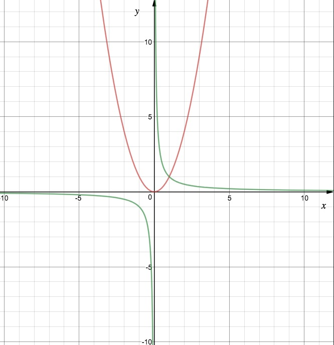
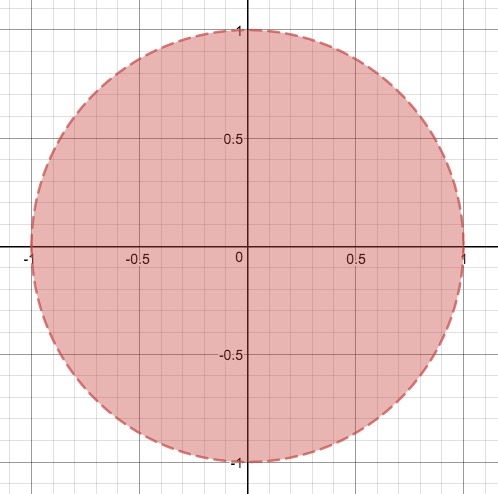

[TOC]
# 图像包含了自身的函数——塔珀自指公式

## 前言
中学时，我们学习了各种各样的函数，比如 y = x^2, y = 1/x，如果把这些函数的图像画在平面直角坐标系上，前者将是一个抛物线（红线），而后者会是一个双曲线（绿线）。如下图：



当然我们也可以把 x 和 y 都放在等式的同一边，比如 x^2 + y^2 = 1，它的图像是一个圆心在原点、半径为 1 的圆圈。甚至不一定非要是等式，比如 x^2 + y^2 < 1，图像是一个圆饼：



如果我告诉你，有一个函数的图像是它自身，你能相信吗？甚至于，这个函数的图像包含了「苟利国家生死以」这几个汉字，你敢信吗？

## 函数图像
上面说到的这个神奇的函数就是本篇文章的主题——[Tupper's self-referential formula][1]，中文名[「塔珀自指公式」][2]。

在范围 `0 <= x < 106, k <= y < k+17` 内，其中，k =

```
4858450636189713423582095962494202044581400587983244549483093085061934704708809
9284506447698655243648499972470249151191104116057391774078569197543265718554420
5721044573588368182982375413963433822519945219165128434833290513119319995350241
3758765239264874613394906870130562295813219481113685339535565290850023875092856
8926945559742815463865107300491067230589335860525440966643512653493636439571255
6569593681518433485760526694016125126695142155053955451915378545752575659074054
0157929001765967965480064427829131488548259914721248506352686630476300
```
这个函数在直角坐标系（x 轴从左至右，y 轴从下至上）上的图像如下：


而它的数学公式是：  


Un-fucking-believable! 这难道是巧合？  
先不论那一大串 k 怎么回事，我知道有些公式恐惧症患者可能已经开始打退堂鼓了……

其实它的原理说白了很简单，厉害点的小学生都能听懂。

## 公式详解
我们来仔细观察一下这个乍看上去让人头大的公式，先向不熟悉数学公式的读者解释两个符号，一个是向下取整符号 `⌊⌋`，意味着求某个数的整数部分，比如 ⌊3.14⌋ 就等于 3，⌊2.99⌋ 还是等于 2。另一个是求余符号 `mod`， `mod(a, b)` 意味着求 a 除以 b 所得的余数，比如 mod(3, 2) 就等于 1。事实上，对于任意一个整数 n，`mod(n, 2) > 1/2` 等价于 n 为奇数。

至于我们这个复杂的公式，我们把 mod 符号里左边那一大串表达式称为 S，它其实在问：S 除以 2 所得的余数，向下取整后是 1 还是 0？更进一步，可以理解为：**S 的整数部分是不是奇数？**这里比较难一眼看穿，建议读者自己举几个例子，比如 S = 2.4/3.2 等等，重点关注 S 的整数部分对结果的影响。

接下来我们分析 S，它的表达式为：


考虑幂中负号的作用，S 可以看成是 ⌊y/17⌋ 除以 2 ^ (17⌊x⌋ + mod(⌊y⌋, 17))

我们先来看分母部分，取整符号太讨厌了，我们假设 x,y 都是整数，那么对应到坐标系上就是一个个整数点，考虑向下取整符号的作用，就是把这个整数点右上方 1x1 大小的正方形中的点都投射到左下角的整数点；所以，最终我们得到的图像是一个个 1x1 大小的正方形小方块，这些小方块的左下角就是使得 S 整数部分为奇数的整数点。

那么分母就化成了 17x + mod(y, 17)，这不就是在坐标系上数格子嘛！y轴从下至上，x轴从左往右，从左下角以 0 开始数：


我们再来看分子 ⌊y/17⌋，它能保证在数格子的时候分子不变吗？当然可以，只要你能保证 y 处在某个范围内，比如 k <= y < k + 17, 而且 k 必须是 17 的整数倍。

那么综合来看 S，它到底在干什么呢？

**一个整数除以 2 的 n 次幂，结果的整数部分是不是奇数，等价于，这个整数的二进制表达右数第 n+1 位是不是 1**

举几个例子：  
7/4 = 1.75，整数部分为奇数；从二进制的角度来，7 的二进制表达是 111，7 除以 2 的 2 次幂，即 111 的右数第 3 位，为 1。  
6/2 = 3，整数部分为奇数；6 的二进制表达为 110，110 的右数第 2 位，为 1。  
2/1 = 2，整数部分为偶数；2 的二进制表达为 10，10 的右数第 1 位（2 除以 2 的 0 次幂），为 0。

这就是整个公式的关键所在了。

在一块宽为 106，高为 17 的格子板上作画，对于每个 1x1 的小格子，我们要么不涂，要么涂满，涂满的记作 1，没涂的记作 0。我们把这些格子涂成公式的模样，按照数格子的顺序把这些 1 和 0 连在一起，形成一个长长的二进制数，然后把这个二进制数化为十进制，再乘以 17，最后就得到了我们最开始的 k。

读者甚至可以自己验算一番，比如我想画一条长为 5 的竖线，那么我根据上面数格子的图，把要涂黑的地方打勾（记为 1），为了简便计算，我们把竖线的位置定为左下角，那么竖线对应的二进制数就是 11111，转化为十进制就是 2^0 + 2^1 + 2^2 + 2^3 + 2^4 = 1 + 2 + 4 + 8 + 16 = 31, 再乘以 17 得到 
527。把这个数字填到[这个页面](demo.html)中，点击作画，它会自动生成对应范围内(0<=x<106, 527<=y<544)的函数图像。

[1]: https://en.wikipedia.org/wiki/Tupper%27s_self-referential_formula
[2]: https://zh.wikipedia.org/wiki/%E5%A1%94%E7%8F%80%E8%87%AA%E6%8C%87%E5%85%AC%E5%BC%8F
[3]: demo.html